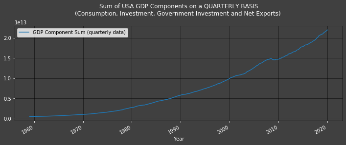

# Forecasting USA GDP via Expenditure Approach and the Holt-Winters Model

Gross Domestic Product (GDP) is often thought of and calculated with an [Expenditure Approach](https://courses.lumenlearning.com/boundless-economics/chapter/measuring-output-using-gdp/) such that $$GDP=C+I+G+(X−M)$$ where  C  = Consumption,  I  = Investment,  G  = Government Spending, &  (X–M)  = Net Exports.

The United States of America( USA)'s GDP (US GDP) is released quarterly by the [Bureau of Economic Analysis, U.S. Department of Commerce](http://product.datastream.com/browse/search.aspx?dsid=ZRQW955&AppGroup=DSAddin&q=USGDP...B&prev=99_GDP). The only aforementioned component of US GDP released on a monthly basis is C, [USA's Consumption Data](http://product.datastream.com/browse/search.aspx?dsid=ZRQW955&AppGroup=DSAddin&q=USPERCONB&prev=99_PERSONAL+CONSUMPTION+EXPENDITURES+(AR)&prev_csrc=12). Monthly figures of GDP figures are thus not available, and estimating such values have proven of interest in academia (Mitchell, Smith, Weale, Wright, and Salazar (2005)) and in practice.

In this article, we will attempt to compute monthly US GDP estimates via the Holt-Winters (HW) method (resources on the HW model can be found [here](https://medium.com/datadriveninvestor/how-to-build-exponential-smoothing-models-using-python-simple-exponential-smoothing-holt-and-da371189e1a1) and - for academics - [here](https://otexts.com/fpp2/holt-winters.html)). We then put ourselves in the shoes of an analyst who only has quarterly GDP component data (C, I, G or (X-M)). She/He uses the latest quarterly releases of GDP component datawhich spans from 2007 (in this study) to last quarter (last month at the earliest). She/He then uses the [Holt-Winters method](https://medium.com/datadriveninvestor/how-to-build-exponential-smoothing-models-using-python-simple-exponential-smoothing-holt-and-da371189e1a1) model to compute a forecast for the current period (month).

Accurate monthly GDP figures can be of great use in macroeconomic models going forward.

## Development Tools & Resources
The example code demonstrating the use case is based on the following development tools and resources:

- Refinitiv's [DataStream](https://www.refinitiv.com/en/products/datastream-macroeconomic-analysis) Web Services (DSWS): Access to DataStream data. A DataStream or Refinitiv Workspace IDentification (ID) will be needed to run the code bellow.
- Python Environment:
Tested with Python 3.7
- Packages: [DatastreamDSWS](https://www.refinitiv.com/en/products/datastream-macroeconomic-analysis), [Numpy](https://numpy.org/), [Pandas](https://pandas.pydata.org/), [statsmodel](https://www.statsmodels.org/stable/index.html), [scipy](https://www.scipy.org/) and [Matplotlib](https://matplotlib.org/). The Python built in modules [os](https://docs.python.org/3/library/os.html), [warnings](https://docs.python.org/3/library/warnings.html?highlight=warnings#module-warnings), [statistics](https://docs.python.org/3/library/statistics.html), [datetime](https://docs.python.org/3/library/datetime.html) and [dateutil](https://dateutil.readthedocs.io/en/stable/) are also required.

$ \\ $
## Import libraries


```python
# The ' from ... import ' structure here allows us to only import the
# module ' python_version ' from the library ' platform ':
import platform
from platform import python_version
print("This code runs on Python version " + python_version() + " in " + platform.architecture()[0])
```

    This code runs on Python version 3.7.4 in 64bit
    

$$ \\ $$
We need to gather our data. Since **Refinitiv's [DataStream](https://www.refinitiv.com/en/products/datastream-macroeconomic-analysis) Web Services (DSWS)** allows for access to the most accurate and wholesome end-of-day (EOD) economic database (DB), naturally it is more than appropriate. We can access DSWS via the Python library "DatastreamDSWS" that can be installed simply by using $\textit{pip install}$.

Make sure to entre correct DataStream credentials


```python
import DatastreamDSWS as DSWS

# We can use our Refinitiv's Datastream Web Socket (DSWS) API keys that allows us to be identified by Refinitiv's back-end services and enables us to request (and fetch) data:

# The username and password is placed in a text file so that it may be used in this code without showing it itself.
DSWS_username = open("Datastream_username.txt","r")
DSWS_password = open("Datastream_password.txt","r")

ds = DSWS.Datastream(username = str(DSWS_username.read()), password = str(DSWS_password.read()))

# It is best to close the files we opened in order to make sure that we don't stop any other services/programs from accessing them if they need to.
DSWS_username.close()
DSWS_password.close() 
```

$$ \\ $$
The following are Python-built-in module/library, therefore it does not have a specific version number.


```python
import os # os is a library used to manipulate files on machines
import datetime # datetime will allow us to manipulate Western World dates
import dateutil # dateutil will allow us to manipulate dates in equations
import warnings # warnings will allow us to manipulate warning messages (such as depreciation messages)
```

$$ \\ $$
statistics, numpy, scipy and statsmodels are needed for datasets' statistical and mathematical manipulations. \
*Make sure to have the latest version of statsmodels, versions before 10 tend not to be able to deal with numbers as large as the ones we are dealing with*.


```python
# pip install --upgrade statsmodels
```


```python
import statistics # This is a Python-built-in module/library, therefore it does not have a specific version number.
import numpy
import statsmodels
from statsmodels.tsa.api import ExponentialSmoothing, SimpleExpSmoothing, Holt
import scipy
from scipy import stats
for i,j in zip(["numpy", "statsmodels", "scipy"], [numpy, statsmodels, scipy]):
    print("The " + str(i) + " library imported in this code is version: " + j.__version__)
```

    The numpy library imported in this code is version: 1.16.5
    The statsmodels library imported in this code is version: 0.11.1
    The scipy library imported in this code is version: 1.3.1
    

$$ \\ $$
pandas will be needed to manipulate data sets


```python
# pip install --upgrade pandas
```


```python
import pandas
pandas.set_option('display.max_columns', None) # This line will ensure that all columns of our data-frames are always shown
print("The pandas library imported in this code is version: " + pandas.__version__)
```

    The pandas library imported in this code is version: 1.0.4
    

$$ \\ $$
matplotlib is needed to plot graphs of all kinds


```python
import matplotlib
import matplotlib.pyplot as plt
print("The matplotlib library imported in this code is version: "+ matplotlib.__version__)
```

    The matplotlib library imported in this code is version: 3.1.1
    

$ \\ $
## Setup Original Functions

### Setup data sets

The cell below defines a function that translates DataStream data into a shape we can work with: a Pandas Dafaframe normalised to the 1st of the month that it was collected in.


```python
# This function will put Refinitiv's DataStream data into a Pandas Dafaframe and normalise it to the 1st of the month it was collected in.
def Translate_to_First_of_the_Month(data, dataname):
    
    # The first 8 characters of the index is the ' yyyy-mm- ', onto which will be added '01'.
    data.index = data.index.astype("str").str.slice_replace(8, repl = "01")
    
    # This line resets the index to a pandas datetime format
    data.index = pandas.to_datetime(data.index)
    
    # This line renames the column as specified in the function
    data.columns = [dataname]
    return data
```

$$ \\ $$
The cell below defines a function that appends our monthly data-frame with chosen data


```python
df = pandas.DataFrame([])
def Add_to_df(data, dataname):
    
    # The ' global df ' allows the function to take the pre-defined variable ' df ' for granted and work from there
    global df
    
    DS_Data_monthly = Translate_to_First_of_the_Month(data, dataname)
    
    # Note that the bellow is (purposefully) different to ' df[dataname] =  DS_Data_monthly'
    df = pandas.merge(df, DS_Data_monthly,
                      how = "outer",
                      left_index = True,
                      right_index=True)
```

$$ \\ $$
### Setup plot functions

The cell below defines a function to plot data on one y axis.


```python
pandas.plotting.register_matplotlib_converters() # Using an implicitly registered datetime converter for a matplotlib plotting method is no longer supported by matplotlib. Current versions of pandas requires explicitly registering matplotlib converters.
def Plot1ax(dataset, ylabel = "", title = "", xlabel = "Year",
            datasubset = [0], datarange = False,
            linescolor = False, figuresize = (12,4),
            facecolor = "0.25", grid = True):
    """ Plot1ax Version 2.0:
    This function returns a Matplotlib graph with default colours and dimensions
    on one y axis (on the left as oppose to two, one on the left and one on the right).
    
    datasubset (list): Needs to be a list of the number of each column within
    the data-set that needs to be labelled on the left.
    
    datarange (bool): If wanting to plot graph from and to a specific point,
    make datarange a list of start and end date.
    
    linescolor (bool/list): (Default: False) This needs to be a list of the color of each
    vector to be ploted, in order they are shown in their dataframe from left to right.
    
    figuresize (tuple): (Default: (12,4)) This can be changed to give graphs of different
    proportions. It is defaulted to a 12 by 4 (ratioed) graph.
    
    facecolor (str): (Default: "0.25") This allows the user to change the
    background color as needed.
    
    grid (bool): (Default: "True") This allows us to decide wether or
    not to include a grid in our graphs.
    """
    
    # This function works if the dataset is specified in names of columns
    # or their placement (first column being the '0th').
    if type(datasubset[0]) == int:
        if datarange == False:
            start_date = str(dataset.iloc[:,datasubset].index[0])
            end_date = str(dataset.iloc[:,datasubset].index[-1])
        else:
            start_date = str(datarange[0])

            if datarange[-1] == -1:
                end_date = str(dataset.iloc[:,datasubset].index[-1])
            else:
                end_date = str(datarange[-1])
    else:
        if datarange == False:
            start_date = str(dataset[datasubset].index[0])
            end_date = str(dataset[datasubset].index[-1])
        else:
            start_date = str(datarange[0])

            if datarange[-1] == -1:
                end_date = str(dataset[datasubset].index[-1])
            else:
                end_date = str(datarange[-1])
        
    
    fig, ax1 = plt.subplots(figsize = figuresize, facecolor = facecolor)
    ax1.tick_params(axis = 'both', colors = 'w')
    ax1.set_facecolor(facecolor)
    fig.autofmt_xdate()
    plt.ylabel(ylabel, color = 'w')
    ax1.set_xlabel(str(xlabel), color = 'w')
    
    if type(datasubset[0]) == int:
        if linescolor == False:
            for i in datasubset: # This is to label all the lines in order to allow matplot lib to create a legend
                ax1.plot(dataset.iloc[:, i].loc[start_date : end_date],
                         label = str(dataset.columns[i]))
        else:
            for i in datasubset: # This is to label all the lines in order to allow matplot lib to create a legend
                ax1.plot(dataset.iloc[:, i].loc[start_date : end_date],
                         label = str(dataset.columns[i]),
                         color = linescolor)
    else:
        if linescolor == False:
            for i in datasubset: # This is to label all the lines in order to allow matplot lib to create a legend
                ax1.plot(dataset[i].loc[start_date : end_date],
                         label = i)
        else:
            for i in datasubset: # This is to label all the lines in order to allow matplot lib to create a legend
                ax1.plot(dataset[i].loc[start_date : end_date],
                         label = i,
                         color = linescolor)
    
    ax1.tick_params(axis = 'y')
    
    if grid == True:
        ax1.grid(color='black', linewidth = 0.5)
    
    ax1.set_title(str(title) + " \n", color = 'w')
    plt.legend()
    plt.show()
```

$$ \\ $$
The cell below defines a function to plot data on two y axis.


```python
def Plot2ax(dataset, rightaxisdata, y1label, y2label, leftaxisdata,
            title = "", xlabel = "Year", y2color = "C1", y1labelcolor = "C0",
            figuresize = (12,4), leftcolors = ('C1'), facecolor = "0.25"):
    """ Plot2ax Version 2.0:
    This function returns a Matplotlib graph with default colours and dimensions
    on two y axis (one on the left and one on the right)
    
    leftaxisdata (list): Needs to be a list of the number of each column within
    the data-set that needs to be labelled on the left
    
    figuresize (tuple): (Default: (12,4)) This can be changed to give graphs of
    different proportions. It is defaulted to a 12 by 4 (ratioed) graph
    
    leftcolors (str / tuple of (a) list(s)): This sets up the line color for data
    expressed with the left hand y-axis. If there is more than one line,
    the list needs to be specified with each line colour specified in a tuple.
    
    facecolor (str): (Default: "0.25") This allows the user to change the
    background color as needed
    """
    
    fig, ax1 = plt.subplots(figsize = figuresize, facecolor = facecolor)
    ax1.tick_params(axis = 'both', colors = 'w')
    ax1.set_facecolor(facecolor)
    fig.autofmt_xdate()
    plt.ylabel(y1label, color = y1labelcolor)
    ax1.set_xlabel(str(xlabel), color = 'w')
    ax1.set_ylabel(str(y1label))
    
    for i in leftaxisdata: # This is to label all the lines in order to allow matplot lib to create a legend
        ax1.plot(dataset.iloc[:, i])
    
    ax1.tick_params(axis = 'y')
    ax1.grid(color='black', linewidth = 0.5)
    
    ax2 = ax1.twinx()  # instantiate a second axes that shares the same x-axis
    color = str(y2color)
    ax2.set_ylabel(str(y2label), color=color)  # we already handled the x-label with ax1
    plt.plot(dataset.iloc[:, list(rightaxisdata)], color=color)
    ax2.tick_params(axis='y', labelcolor='w')
    
    ax1.set_title(str(title) + " \n", color='w')
    
    fig.tight_layout()  # otherwise the right y-label is slightly clipped
    plt.show()
```

$$ \\ $$
The cell below defines a function to plot data regressed on time.


```python
def Plot_Regression(x, y, slope, intercept, ylabel,
                    title = "", xlabel = "Year", facecolor = "0.25", data_point_type = ".", original_data_color = "C1",
                    time_index = [], time_index_step = 48,
                    figuresize = (12,4),
                    line_of_best_fit_color = "b"):
    """ Plot_Regression Version 1.0:
    Plots the regression line with its data with appropriate defult Refinitiv colours.
    
    facecolor (str): (Default: "0.25") This allows the user to change the background color as needed
    
    figuresize (tuple): (Default: (12,4)) This can be changed to give graphs of different proportions. It is defaulted to a 12 by 4 (ratioed) graph
    
    line_of_best_fit_color (str): This allows the user to change the background color as needed.
    
    ' time_index ' and ' time_index_step ' allow us to dictate the fequency of the ticks on the x-axis of our graph.
    """
    
    fig, ax1 = plt.subplots(figsize = figuresize, facecolor = facecolor)
    ax1.tick_params(axis = "both", colors = "w")
    ax1.set_facecolor(facecolor)
    fig.autofmt_xdate()
    plt.ylabel(ylabel, color = 'w')
    ax1.set_xlabel(xlabel, color = 'w')
    ax1.plot(x, y, data_point_type, label='original data', color = original_data_color)
    ax1.plot(x, intercept + slope * x, 'r', label = 'fitted line', color = line_of_best_fit_color)
    ax1.tick_params(axis = 'y')
    ax1.grid(color='black', linewidth = 0.5)
    ax1.set_title(title + " \n", color='w')
    plt.legend()
    
    if len(time_index) != 0:
        # locs, labels = plt.xticks()
        plt.xticks(numpy.arange(len(y), step = time_index_step),
                   [i for i in time_index[0::time_index_step]])
    
    plt.show()
```

$$ \\ $$
### Setup Statistics Tools


```python
def Single_period_Geometric_Growth(data):
    data = list(data)
    single_period_geometric_growth = ( (data[-1]/data[0])**(1/((len(data))-1)) ) - 1 # note that we use ' len(data) - 1 ' instead of ' len(data) ' as the former already lost its degree of freedom just like we want it to.
    return single_period_geometric_growth
```

The cell below defines a function that creates and displays a table of statistics for all vectors (columns) within any two specified datasets.


```python
def Statistics_Table(dataset1, dataset2 = ""):
    
    Statistics_Table_Columns = list(dataset1.columns)
    
    if str(dataset2) != "":
        [Statistics_Table_Columns.append(str(i)) for i in dataset2.columns]
    
    Statistics_Table = pandas.DataFrame(columns = ["Mean", "Mean of Absolute Values",
                                                   "Standard Deviation",
                                                   "Median", "Skewness",
                                                   "Kurtosis",
                                                   "Single Period Growth Geometric Average"],
                                        index = [c for c in Statistics_Table_Columns])
    
    def Statistics_Table_function(data):
        for c in data.columns:
            Statistics_Table["Mean"][str(c)] = numpy.mean(data[str(c)].dropna())
            Statistics_Table["Mean of Absolute Values"][str(c)] = numpy.mean(abs(data[str(c)].dropna()))
            Statistics_Table["Standard Deviation"][str(c)] = numpy.std(data[str(c)].dropna())
            Statistics_Table["Median"][str(c)] = numpy.median(data[str(c)].dropna())
            Statistics_Table["Skewness"][str(c)] = scipy.stats.skew(data[str(c)].dropna())
            Statistics_Table["Kurtosis"][str(c)] = scipy.stats.kurtosis(data[str(c)].dropna())
            
            if len(data[str(c)].dropna()) != 1 or data[str(c)].dropna()[0] != 0: # This if statement is needed in case we end up asking for the computation of a value divided by 0.
                Statistics_Table["Single Period Growth Geometric Average"][str(c)] = Single_period_Geometric_Growth(data[str(c)].dropna())
    
    Statistics_Table_function(dataset1)
    
    if str(dataset2) != "":
        Statistics_Table_function(dataset2)
    
    return Statistics_Table
```

$$ \\ $$
## Monthly Data

$$ \\ $$
### [U.S.A.'s Consumption Data](http://product.datastream.com/browse/search.aspx?dsid=ZRQW955&AppGroup=DSAddin&q=USPERCONB&prev=99_PERSONAL+CONSUMPTION+EXPENDITURES+(AR)&prev_csrc=12)


```python
Add_to_df(data = ds.get_data(tickers = 'USPERCONB', # this is the ticker for United States, Personal Outlays, Personal Consumption Expenditure, Overall, Total, Current Prices, AR, SA, USD
                             fields = "X", # DataStream's default field is 'X'
                             start = '1950-02-01',
                             freq = 'M') * 1000000000, # This data is given in units of 1000000000
          dataname = "Consumption (monthly data)")
```

$$ \\ $$
## Quarterly Data


```python
# Our data is released quarterly, so we have to shape it into a monthly database. The function below will allow for this:
def Quarterly_To_Monthly(data, dataname, deflator = False):
    """Quarterly data can sometimes be recorded in a monthly data-frames.
    This function returns a pandas data-frame in which inter-quarterly cells are populated.
    
    data (pandas.DataFrame): a pandas data-frame of the quarterly data
    that is wanted in a monthly pandas data-frame
    
    dataname (str): a string of the name wanted for the column of returned data-frame
    
    deflator (bool): Set to False by default. If the data passed is an inflator,
    setting ' deflator ' to True will inverse it)
    """
    
    data_proper, data_full_index = [], []
    for i in range(0, len(data)):
        [data_proper.append(float(data.iloc[j])) for j in [i,i,i]]
        [data_full_index.append(datetime.datetime.strptime(str(data.index[i])[0:8] + "01", "%Y-%m-%d") + dateutil.relativedelta.relativedelta(months =+ j)) for j in range(0,3)]
    
    data = pandas.DataFrame(data = data_proper, columns = [dataname], index = data_full_index)
    
    if deflator == True:
        data = pandas.DataFrame(data = 1 / (data / data.iloc[-1]), columns = [dataname], index = data_full_index)
    
    data.index = pandas.to_datetime(data.index)
    
    return data
```


```python
def Collect_Quarterly_Data(ticker, data_name, field = "X", start = "1950-02-01", freq = "M",
                           multiplier = 1):
    """ This function was created specifically for this script/article. It decreases the
    number of repeated code lines collecting data in several forms in our df.
    
    ticker (str/list): string of the one DataStream ticker or list of multiple DataStream
    tickers to be collected.
    
    field (str): Set to "X" by default. Field to be collected for the ticker(s) in question.
    
    start (str): Set to "1950-02-01" by default. This is the date at which the data is to be
    collected from on DataStream.
    
    freq (str): Set to "M" by default. This is the frequency at which you would like the
    data to be collected from DataStream. "M" for monthly, "Q" for quarterly, "A" for 
    annually, et cetera. If ' freq ' is set to a higher frequency than is available on
    DataSream, the highest possible one will be used (exempli gratia: if asking for "M"
    when only "Q" data is available, data will be collected as if freq = "Q").
    
    multiplier (int/float): Set to ' 1 ' by default. Our collected data will be multiplied
    by this multiplier.
    """
    
    # Only DataStream requests returning numbers are meant to be ask for in this function.
    # The following try loop will account for the case where DataStream returns something
    # else (or somenthing else is asked of it):
    try:
        # The multiplier can only be used if data in ' dsdata ' is numeric
        dsdata = ds.get_data(tickers = ticker, fields = field,
                             start = '1950-02-01', freq = 'M') * multiplier
    except:
        dsdata = ds.get_data(tickers = ticker, fields = field,
                             start = '1950-02-01', freq = 'M')
    
    # Adding data for every quarter in our df:
    Add_to_df(data = dsdata.copy(), dataname = data_name + " (quarterly data)")
    
    # Adding quarterly data for every month in our df:
    Add_to_df(data = Quarterly_To_Monthly(dsdata.copy(),
                                          dataname = data_name + " (quarterly data)",
                                          deflator = False),
              dataname = data_name + " (monthly step data)")
```

$$ \\ $$
### [U.S.A.'s Investment Data](http://product.datastream.com/browse/search.aspx?dsid=ZRQW955&AppGroup=DSAddin&q=USGFCF..B&prev=99_gross+private+domestic+investment&nav_category=12)


```python
Collect_Quarterly_Data(ticker = "USGFCF..B", data_name = "Investment", multiplier = 1000000000)
```

$$ \\ $$
### [U.S.A.'s Government Investment](http://product.datastream.com/browse/search.aspx?dsid=ZRQW955&AppGroup=DSAddin&q=USCNGOV.B&prev=99_government+consumption+expenditures+and+gross+investment&nav_category=12)


```python
Collect_Quarterly_Data(ticker = "USCNGOV.B", data_name = "Government Investment", multiplier = 1000000000)
```

$$ \\ $$
### [U.S.A.'s Net Exports of Goods and Services](http://product.datastream.com/browse/search.aspx?dsid=ZRQW955&AppGroup=DSAddin&q=USBALGSVB&prev=99_Net+Exports+of+Goods+and+Services&nav_category=12)


```python
Collect_Quarterly_Data(ticker = "USBALGSVB", data_name = "Net Exports", multiplier = 1000000000)
```

$$ \\ $$
### G.D.P. Component Sum


```python
df["GDP Component Sum (quarterly data)"] = df.dropna()["Consumption (monthly data)"] + df.dropna()["Investment (quarterly data)"] + df.dropna()["Government Investment (quarterly data)"] + df.dropna()["Net Exports (quarterly data)"]
```


```python
Plot1ax(dataset = pandas.DataFrame(df["GDP Component Sum (quarterly data)"].dropna()),
        title = "Sum of USA GDP Components on a QUARTERLY BASIS\n(Consumption, Investment, Government Investment and Net Exports)")
```





```python
df["GDP Component Sum (monthly step data)"] = df["Consumption (monthly data)"] + df["Investment (monthly step data)"] + df["Government Investment (monthly step data)"] + df["Net Exports (monthly step data)"]
```


```python
Plot1ax(dataset = pandas.DataFrame(df["GDP Component Sum (monthly step data)"].dropna()),
        title = "Sum of USA GDP Components on a MONTHLY BASIS\n(Consumption, Investment, Government Investment and Net Exports)")
```


$$ \\ $$
### [U.S.A.'s G.D.P.](http://product.datastream.com/browse/search.aspx?dsid=ZRQW955&AppGroup=DSAddin&q=USGDP...B&prev=99_USA+GDP&nav_category=12)

To check our model, we can use ['United States, National Product Account, Gross Domestic Product, Overall, Total, Current Prices, AR, SA, USD'](http://product.datastream.com/browse/search.aspx?dsid=ZRQW955&AppGroup=DSAddin&q=USGDP...B&prev=99_USA+GDP&nav_category=12).


```python
Add_to_df(data = ds.get_data(tickers = 'USGDP...B',
                             fields = "X",
                             start = '1950-02-01',
                             freq = 'M') * 1000000000,
          dataname = "GDP (every quarter)")
```


```python
df["GDP (monthly step data)"] = Quarterly_To_Monthly(data = df["GDP (every quarter)"],
                                                     dataname = "GDP (monthly step data)").dropna()
```

$$ \\ $$
### Data Résumé


```python
Plot1ax(title = "USA GDP and its components (quarterly data)",
        dataset = df.dropna(), ylabel = "Today's $",
        datasubset = ["Investment (quarterly data)",
                      "Government Investment (quarterly data)",
                      "Net Exports (quarterly data)",
                      "Net Exports (quarterly data)",
                      "GDP Component Sum (quarterly data)",
                      "GDP (every quarter)"])
```


Note that the GDP and GDP Component Sum datapoints align so well that they are indistinguishable in the graph above


```python
df
```


<div>
<style scoped>
    .dataframe tbody tr th:only-of-type {
        vertical-align: middle;
    }

    .dataframe tbody tr th {
        vertical-align: top;
    }

    .dataframe thead th {
        text-align: right;
    }
</style>
<table border="1" class="dataframe">
  <thead>
    <tr style="text-align: right;">
      <th></th>
      <th>Consumption (monthly data)</th>
      <th>Investment (quarterly data)</th>
      <th>Investment (monthly step data)</th>
      <th>Government Investment (quarterly data)</th>
      <th>Government Investment (monthly step data)</th>
      <th>Net Exports (quarterly data)</th>
      <th>Net Exports (monthly step data)</th>
      <th>GDP Component Sum (quarterly data)</th>
      <th>GDP Component Sum (monthly step data)</th>
      <th>GDP (every quarter)</th>
      <th>GDP (monthly step data)</th>
    </tr>
  </thead>
  <tbody>
    <tr>
      <th>1950-02-01</th>
      <td>NaN</td>
      <td>4.472500e+10</td>
      <td>4.472500e+10</td>
      <td>4.895600e+10</td>
      <td>4.895600e+10</td>
      <td>2.203000e+09</td>
      <td>2.203000e+09</td>
      <td>NaN</td>
      <td>NaN</td>
      <td>2.808280e+11</td>
      <td>2.808280e+11</td>
    </tr>
    <tr>
      <th>1950-03-01</th>
      <td>NaN</td>
      <td>NaN</td>
      <td>4.472500e+10</td>
      <td>NaN</td>
      <td>4.895600e+10</td>
      <td>NaN</td>
      <td>2.203000e+09</td>
      <td>NaN</td>
      <td>NaN</td>
      <td>NaN</td>
      <td>2.808280e+11</td>
    </tr>
    <tr>
      <th>1950-04-01</th>
      <td>NaN</td>
      <td>NaN</td>
      <td>4.472500e+10</td>
      <td>NaN</td>
      <td>4.895600e+10</td>
      <td>NaN</td>
      <td>2.203000e+09</td>
      <td>NaN</td>
      <td>NaN</td>
      <td>NaN</td>
      <td>2.808280e+11</td>
    </tr>
    <tr>
      <th>1950-05-01</th>
      <td>NaN</td>
      <td>4.945800e+10</td>
      <td>4.945800e+10</td>
      <td>4.964300e+10</td>
      <td>4.964300e+10</td>
      <td>1.643000e+09</td>
      <td>1.643000e+09</td>
      <td>NaN</td>
      <td>NaN</td>
      <td>2.903830e+11</td>
      <td>2.903830e+11</td>
    </tr>
    <tr>
      <th>1950-06-01</th>
      <td>NaN</td>
      <td>NaN</td>
      <td>4.945800e+10</td>
      <td>NaN</td>
      <td>4.964300e+10</td>
      <td>NaN</td>
      <td>1.643000e+09</td>
      <td>NaN</td>
      <td>NaN</td>
      <td>NaN</td>
      <td>2.903830e+11</td>
    </tr>
    <tr>
      <th>...</th>
      <td>...</td>
      <td>...</td>
      <td>...</td>
      <td>...</td>
      <td>...</td>
      <td>...</td>
      <td>...</td>
      <td>...</td>
      <td>...</td>
      <td>...</td>
      <td>...</td>
    </tr>
    <tr>
      <th>2020-03-01</th>
      <td>1.390677e+13</td>
      <td>NaN</td>
      <td>3.669469e+12</td>
      <td>NaN</td>
      <td>3.850661e+12</td>
      <td>NaN</td>
      <td>-5.261540e+11</td>
      <td>NaN</td>
      <td>2.090074e+13</td>
      <td>NaN</td>
      <td>2.153491e+13</td>
    </tr>
    <tr>
      <th>2020-04-01</th>
      <td>1.201326e+13</td>
      <td>NaN</td>
      <td>3.669469e+12</td>
      <td>NaN</td>
      <td>3.850661e+12</td>
      <td>NaN</td>
      <td>-5.261540e+11</td>
      <td>NaN</td>
      <td>1.900724e+13</td>
      <td>NaN</td>
      <td>2.153491e+13</td>
    </tr>
    <tr>
      <th>2020-05-01</th>
      <td>NaN</td>
      <td>NaN</td>
      <td>NaN</td>
      <td>NaN</td>
      <td>NaN</td>
      <td>NaN</td>
      <td>NaN</td>
      <td>NaN</td>
      <td>NaN</td>
      <td>NaN</td>
      <td>NaN</td>
    </tr>
    <tr>
      <th>2020-06-01</th>
      <td>NaN</td>
      <td>NaN</td>
      <td>NaN</td>
      <td>NaN</td>
      <td>NaN</td>
      <td>NaN</td>
      <td>NaN</td>
      <td>NaN</td>
      <td>NaN</td>
      <td>NaN</td>
      <td>NaN</td>
    </tr>
    <tr>
      <th>2020-07-01</th>
      <td>NaN</td>
      <td>NaN</td>
      <td>NaN</td>
      <td>NaN</td>
      <td>NaN</td>
      <td>NaN</td>
      <td>NaN</td>
      <td>NaN</td>
      <td>NaN</td>
      <td>NaN</td>
      <td>NaN</td>
    </tr>
  </tbody>
</table>
<p>846 rows × 11 columns</p>
</div>


$$ \\ $$
### [Holt-Winters (HW) method](https://medium.com/datadriveninvestor/how-to-build-exponential-smoothing-models-using-python-simple-exponential-smoothing-holt-and-da371189e1a1)

$$ \\ $$
#### Creating a function to streamline use of Holt-Winters model


```python
def Hot_Winders_Method(name, forecast_period = 3, negative_accounting = False, silence_warings = True,
                       figure_size = (15,4), face_color = "0.25", point_style = "-", plot_color = "blue",
                       fitted_point_style = "-", fitted_point_color = "C1", xlabel = "Years",
                       forecasted_point_style = "-", forecasted_point_color = "#328203"):
    """ This function was created specifically for this script/article. It uses the Holt-Winters
    method to construct estimates and forecasts, adds it to ' df 'and plots the original data against
    the estimates and forecasts.
    Necessitates the function ' Quarterly_To_Monthly '
    
    name (str): Name of the GDP component in question. This component must be included in ' df '.
    
    forecast_period (int): Set to ' 3 ' as default. Number of periods we wish to display forecasts for.
    
    negative_accounting (bool): Set to False by default. If set to True, this accounts for negative values
    in that it does not display forecasted values explicitly or the graph because they would be shifted up.
    
    figure_size, face_color, point_style, plot_color, fitted_point_style, fitted_point_color, xlabel,
    forecasted_point_style, and forecasted_point_color are variables to modify the plot returned.
    """
    global df
    
    if negative_accounting == True:
        # First: we need to note that the Holt-Winters model only works for positive datasets.
        # the following is to account for negative values:
        _data_min_p1 = numpy.absolute(pandas.DataFrame.min(df[name + " (monthly step data)"])) + 1
        _data = (_data_min_p1 + df[name + " (monthly step data)"].copy()).dropna()
        
        df[name + " (monthly step data) positive"] = _data
    else:
        _data_min_p1 = 0
        _data = df[name + " (monthly step data)"].dropna()
    
    if silence_warings == True:
        # The following will throw errors informing us that the unspecified Holt-Winters Exponential Smoother
        # parameters will be chosen by the default ' statsmodels.tsa.api.ExponentialSmoothing ' optimal ones.
        # This is preferable and doesn't need to be stated for each iteration in the loop.
        warnings.simplefilter("ignore")
    
    model_fit = statsmodels.tsa.holtwinters.ExponentialSmoothing(_data.dropna(),
                                                         seasonal_periods = 12,
                                                         trend = 'add',
                                                         damped=True).fit(use_boxcox=True)
    
    df[name + " fitted values (monthly step data)"] = model_fit.fittedvalues - _data_min_p1
    df[name + " forecasts (monthly step data)"] = model_fit.forecast(forecast_period) - _data_min_p1
    df[name + " fitted values' real errors (monthly step data)"] = df[name + " fitted values (monthly step data)"] - df[name + " (monthly step data)"]
    
    if negative_accounting == False:
        # See the HW model's forecasts:
        print(name + " forecasts:")
        display(model_fit.forecast(forecast_period))
        
        
        # Plot the newly created Exponential Smoothing data
        fig1, ax1 = plt.subplots(figsize = figure_size, facecolor = face_color)
        df[name + " (monthly step data)"].dropna().plot(style = point_style,
                                                        color = plot_color,
                                                        legend = True).legend([name + " (monthly step data)"])
        
        model_fit.fittedvalues.plot(style = fitted_point_style,
                                    color = fitted_point_color,
                                    label = name + " model fit",
                                    legend = True)
        
        model_fit.forecast(forecast_period).plot(style = forecasted_point_style,
                                                 color = forecasted_point_color,
                                                 label = name + " model forecast",
                                                 legend = True)
        
        ax1.set_facecolor(face_color)
        ax1.tick_params(axis = "both", colors = "w")
        plt.ylabel("Ratio", color = "w")
        ax1.set_xlabel(xlabel, color = "w")
        ax1.grid(color='black', linewidth = 0.5)
        
        # The default 'forecasted_point_color' is "#328203", i.e.: green
        if forecasted_point_color == "#328203":
            ax1.set_title("Forecasting USA Real GDP's "+ name + " component of properties" +
                      "\nusing the Holt-Winters method (HW) (monthly data) (forecasts in green)" +
                      " \n", color='w')
        else:
            ax1.set_title("Forecasting U.S.A. Real G.D.P.'s "+ name + " component of properties" +
                          "\nusing the Holt-Winters method (HW) (monthly data) (forecasts in " +
                          forecasted_point_color + ") \n", color='w')

        ax1.legend()
        plt.show()
    
    if silence_warings == True:
        # We want our program to let us know of warnings from now on; they were only disabled for the for loop above.
        warnings.simplefilter("default")
```

$$ \\ $$
##### Example of our use of the Holt-Winters model: Investment data
The Hot_Winders_Method function may be a bit daunting, so let’s look at it step by step. 1st, this is our Investment data:


```python
df["Investment" + " (monthly step data)"].dropna()
```


    1950-02-01    4.472500e+10
    1950-03-01    4.472500e+10
    1950-04-01    4.472500e+10
    1950-05-01    4.945800e+10
    1950-06-01    4.945800e+10
                      ...     
    2019-12-01    3.680236e+12
    2020-01-01    3.680236e+12
    2020-02-01    3.669469e+12
    2020-03-01    3.669469e+12
    2020-04-01    3.669469e+12
    Name: Investment (monthly step data), Length: 843, dtype: float64


Notice that this is 'monthly step data', i.e. we only collected quarterly data and filled in the blanks (every month in-between each published value) with the latest published value available.

$$ \\ $$
2nd: We apply the Holt-Winters model to this data to compute estimates:


```python
statsmodels.tsa.holtwinters.ExponentialSmoothing(df["Investment" + " (monthly step data)"].dropna(),
                                                 seasonal_periods = 12,
                                                 trend = 'add',
                                                 damped=True).fit(use_boxcox=True).fittedvalues
```

    C:\ProgramData\Anaconda3\lib\site-packages\statsmodels\tsa\base\tsa_model.py:162: ValueWarning: No frequency information was provided, so inferred frequency MS will be used.
      % freq, ValueWarning)
    C:\ProgramData\Anaconda3\lib\site-packages\statsmodels\tsa\holtwinters.py:731: RuntimeWarning: invalid value encountered in greater_equal
      loc = initial_p >= ub
    C:\ProgramData\Anaconda3\lib\site-packages\statsmodels\tsa\holtwinters.py:744: ConvergenceWarning: Optimization failed to converge. Check mle_retvals.
      ConvergenceWarning)
    


    1950-02-01    4.473305e+10
    1950-03-01    4.473402e+10
    1950-04-01    4.473169e+10
    1950-05-01    4.472868e+10
    1950-06-01    4.835530e+10
                      ...     
    2019-12-01    3.679554e+12
    2020-01-01    3.680596e+12
    2020-02-01    3.680928e+12
    2020-03-01    3.672520e+12
    2020-04-01    3.668037e+12
    Length: 843, dtype: float64


Getting warnings at this stage is expected due to computational limitations, they should not impede our study.

$$ \\ $$
#### U.S.A.'s Investments' Estimates using the HW method


```python
Hot_Winders_Method(name = "Investment")
```

    Investment forecasts:
    


    2020-05-01    3.666572e+12
    2020-06-01    3.664588e+12
    2020-07-01    3.662814e+12
    Freq: MS, dtype: float64


```python
# the ' pandas.DataFrame ' here is only there to make Jupyter return a Markdown table that looks better than the raw ' print ' output.
pandas.DataFrame(Statistics_Table(dataset1 = df).loc[["Investment forecasts (monthly step data)",
                                                      "Investment fitted values' real errors (monthly step data)"]]["Mean of Absolute Values"])
```


<div>
<style scoped>
    .dataframe tbody tr th:only-of-type {
        vertical-align: middle;
    }

    .dataframe tbody tr th {
        vertical-align: top;
    }

    .dataframe thead th {
        text-align: right;
    }
</style>
<table border="1" class="dataframe">
  <thead>
    <tr style="text-align: right;">
      <th></th>
      <th>Mean of Absolute Values</th>
    </tr>
  </thead>
  <tbody>
    <tr>
      <th>Investment forecasts (monthly step data)</th>
      <td>3.66466e+12</td>
    </tr>
    <tr>
      <th>Investment fitted values' real errors (monthly step data)</th>
      <td>7.88281e+09</td>
    </tr>
  </tbody>
</table>
</div>


$$ \\ $$
#### U.S.A.'s Government Investment using the HW method


```python
Hot_Winders_Method(name = "Government Investment")
```

    Government Investment forecasts:
    


    2020-05-01    3.866814e+12
    2020-06-01    3.876213e+12
    2020-07-01    3.885343e+12
    Freq: MS, dtype: float64


$$ \\ $$
#### U.S.A.'s Net Exports of Goods and Services using the HW method


```python
Hot_Winders_Method(name = "Net Exports", negative_accounting = True)
```

$$ \\ $$
### df with Holt-Winters estimates

Remember that certain measurements were not published all the way back in 1950; we only went all the way back to show how far one may try and go. As a result, certain rows in ' df ' will have a few 'NaN's at the start. Remember also that some variables (rows) are published only every quarter (quarterly data), so they ought to have 'NaN' values inter-quarter. These 'NaN's are expected and handled.


```python
df
```


<div>
<style scoped>
    .dataframe tbody tr th:only-of-type {
        vertical-align: middle;
    }

    .dataframe tbody tr th {
        vertical-align: top;
    }

    .dataframe thead th {
        text-align: right;
    }
</style>
<table border="1" class="dataframe">
  <thead>
    <tr style="text-align: right;">
      <th></th>
      <th>Consumption (monthly data)</th>
      <th>Investment (quarterly data)</th>
      <th>Investment (monthly step data)</th>
      <th>Government Investment (quarterly data)</th>
      <th>Government Investment (monthly step data)</th>
      <th>Net Exports (quarterly data)</th>
      <th>Net Exports (monthly step data)</th>
      <th>GDP Component Sum (quarterly data)</th>
      <th>GDP Component Sum (monthly step data)</th>
      <th>GDP (every quarter)</th>
      <th>GDP (monthly step data)</th>
      <th>Investment fitted values (monthly step data)</th>
      <th>Investment forecasts (monthly step data)</th>
      <th>Investment fitted values' real errors (monthly step data)</th>
      <th>Government Investment fitted values (monthly step data)</th>
      <th>Government Investment forecasts (monthly step data)</th>
      <th>Government Investment fitted values' real errors (monthly step data)</th>
      <th>Net Exports (monthly step data) positive</th>
      <th>Net Exports fitted values (monthly step data)</th>
      <th>Net Exports forecasts (monthly step data)</th>
      <th>Net Exports fitted values' real errors (monthly step data)</th>
    </tr>
  </thead>
  <tbody>
    <tr>
      <th>1950-02-01</th>
      <td>NaN</td>
      <td>4.472500e+10</td>
      <td>4.472500e+10</td>
      <td>4.895600e+10</td>
      <td>4.895600e+10</td>
      <td>2.203000e+09</td>
      <td>2.203000e+09</td>
      <td>NaN</td>
      <td>NaN</td>
      <td>2.808280e+11</td>
      <td>2.808280e+11</td>
      <td>4.473305e+10</td>
      <td>NaN</td>
      <td>8.046422e+06</td>
      <td>4.874360e+10</td>
      <td>NaN</td>
      <td>-2.124022e+08</td>
      <td>8.078330e+11</td>
      <td>2.203000e+09</td>
      <td>NaN</td>
      <td>6.103516e-04</td>
    </tr>
    <tr>
      <th>1950-03-01</th>
      <td>NaN</td>
      <td>NaN</td>
      <td>4.472500e+10</td>
      <td>NaN</td>
      <td>4.895600e+10</td>
      <td>NaN</td>
      <td>2.203000e+09</td>
      <td>NaN</td>
      <td>NaN</td>
      <td>NaN</td>
      <td>2.808280e+11</td>
      <td>4.473402e+10</td>
      <td>NaN</td>
      <td>9.016674e+06</td>
      <td>4.902633e+10</td>
      <td>NaN</td>
      <td>7.033441e+07</td>
      <td>8.078330e+11</td>
      <td>2.203000e+09</td>
      <td>NaN</td>
      <td>6.103516e-04</td>
    </tr>
    <tr>
      <th>1950-04-01</th>
      <td>NaN</td>
      <td>NaN</td>
      <td>4.472500e+10</td>
      <td>NaN</td>
      <td>4.895600e+10</td>
      <td>NaN</td>
      <td>2.203000e+09</td>
      <td>NaN</td>
      <td>NaN</td>
      <td>NaN</td>
      <td>2.808280e+11</td>
      <td>4.473169e+10</td>
      <td>NaN</td>
      <td>6.693394e+06</td>
      <td>4.914832e+10</td>
      <td>NaN</td>
      <td>1.923165e+08</td>
      <td>8.078330e+11</td>
      <td>2.203000e+09</td>
      <td>NaN</td>
      <td>6.103516e-04</td>
    </tr>
    <tr>
      <th>1950-05-01</th>
      <td>NaN</td>
      <td>4.945800e+10</td>
      <td>4.945800e+10</td>
      <td>4.964300e+10</td>
      <td>4.964300e+10</td>
      <td>1.643000e+09</td>
      <td>1.643000e+09</td>
      <td>NaN</td>
      <td>NaN</td>
      <td>2.903830e+11</td>
      <td>2.903830e+11</td>
      <td>4.472868e+10</td>
      <td>NaN</td>
      <td>-4.729321e+09</td>
      <td>4.917447e+10</td>
      <td>NaN</td>
      <td>-4.685265e+08</td>
      <td>8.072730e+11</td>
      <td>2.203000e+09</td>
      <td>NaN</td>
      <td>5.600000e+08</td>
    </tr>
    <tr>
      <th>1950-06-01</th>
      <td>NaN</td>
      <td>NaN</td>
      <td>4.945800e+10</td>
      <td>NaN</td>
      <td>4.964300e+10</td>
      <td>NaN</td>
      <td>1.643000e+09</td>
      <td>NaN</td>
      <td>NaN</td>
      <td>NaN</td>
      <td>2.903830e+11</td>
      <td>4.835530e+10</td>
      <td>NaN</td>
      <td>-1.102705e+09</td>
      <td>4.960638e+10</td>
      <td>NaN</td>
      <td>-3.662454e+07</td>
      <td>8.072730e+11</td>
      <td>1.677304e+09</td>
      <td>NaN</td>
      <td>3.430377e+07</td>
    </tr>
    <tr>
      <th>...</th>
      <td>...</td>
      <td>...</td>
      <td>...</td>
      <td>...</td>
      <td>...</td>
      <td>...</td>
      <td>...</td>
      <td>...</td>
      <td>...</td>
      <td>...</td>
      <td>...</td>
      <td>...</td>
      <td>...</td>
      <td>...</td>
      <td>...</td>
      <td>...</td>
      <td>...</td>
      <td>...</td>
      <td>...</td>
      <td>...</td>
      <td>...</td>
    </tr>
    <tr>
      <th>2020-03-01</th>
      <td>1.390677e+13</td>
      <td>NaN</td>
      <td>3.669469e+12</td>
      <td>NaN</td>
      <td>3.850661e+12</td>
      <td>NaN</td>
      <td>-5.261540e+11</td>
      <td>NaN</td>
      <td>2.090074e+13</td>
      <td>NaN</td>
      <td>2.153491e+13</td>
      <td>3.672520e+12</td>
      <td>NaN</td>
      <td>3.050993e+09</td>
      <td>3.853500e+12</td>
      <td>NaN</td>
      <td>2.839156e+09</td>
      <td>2.794760e+11</td>
      <td>-5.253440e+11</td>
      <td>NaN</td>
      <td>8.099583e+08</td>
    </tr>
    <tr>
      <th>2020-04-01</th>
      <td>1.201326e+13</td>
      <td>NaN</td>
      <td>3.669469e+12</td>
      <td>NaN</td>
      <td>3.850661e+12</td>
      <td>NaN</td>
      <td>-5.261540e+11</td>
      <td>NaN</td>
      <td>1.900724e+13</td>
      <td>NaN</td>
      <td>2.153491e+13</td>
      <td>3.668037e+12</td>
      <td>NaN</td>
      <td>-1.432291e+09</td>
      <td>3.864030e+12</td>
      <td>NaN</td>
      <td>1.336876e+10</td>
      <td>2.794760e+11</td>
      <td>-5.180397e+11</td>
      <td>NaN</td>
      <td>8.114276e+09</td>
    </tr>
    <tr>
      <th>2020-05-01</th>
      <td>NaN</td>
      <td>NaN</td>
      <td>NaN</td>
      <td>NaN</td>
      <td>NaN</td>
      <td>NaN</td>
      <td>NaN</td>
      <td>NaN</td>
      <td>NaN</td>
      <td>NaN</td>
      <td>NaN</td>
      <td>NaN</td>
      <td>3.666572e+12</td>
      <td>NaN</td>
      <td>NaN</td>
      <td>3.866814e+12</td>
      <td>NaN</td>
      <td>NaN</td>
      <td>NaN</td>
      <td>-5.202101e+11</td>
      <td>NaN</td>
    </tr>
    <tr>
      <th>2020-06-01</th>
      <td>NaN</td>
      <td>NaN</td>
      <td>NaN</td>
      <td>NaN</td>
      <td>NaN</td>
      <td>NaN</td>
      <td>NaN</td>
      <td>NaN</td>
      <td>NaN</td>
      <td>NaN</td>
      <td>NaN</td>
      <td>NaN</td>
      <td>3.664588e+12</td>
      <td>NaN</td>
      <td>NaN</td>
      <td>3.876213e+12</td>
      <td>NaN</td>
      <td>NaN</td>
      <td>NaN</td>
      <td>-5.175651e+11</td>
      <td>NaN</td>
    </tr>
    <tr>
      <th>2020-07-01</th>
      <td>NaN</td>
      <td>NaN</td>
      <td>NaN</td>
      <td>NaN</td>
      <td>NaN</td>
      <td>NaN</td>
      <td>NaN</td>
      <td>NaN</td>
      <td>NaN</td>
      <td>NaN</td>
      <td>NaN</td>
      <td>NaN</td>
      <td>3.662814e+12</td>
      <td>NaN</td>
      <td>NaN</td>
      <td>3.885343e+12</td>
      <td>NaN</td>
      <td>NaN</td>
      <td>NaN</td>
      <td>-5.157501e+11</td>
      <td>NaN</td>
    </tr>
  </tbody>
</table>
<p>846 rows × 21 columns</p>
</div>


$$ \\ $$
## Back-testing our Method

The Python function defined in the cell below returns the In-Sample Recursive Prediction values of ' data ' using the Holt-Winters exponential smoother Plus it then provides forecasts for One Out-Of-Sample period (thus the acronym 'ISRPHWPOOOF'):


```python
def ISRPHWPOOOF(data_set, dataset_name, start, result_name, enforce_cap = False, cap = 1.1):
    """ ISRPHWPOOOF Version 3.0:
    
    data_set (pandas dataset): dataframe where the data is stored
    
    dataset_name (str): Our data is likely to be in a pandas dataframe with dates for
    indexes in order to eleviate any date sinking issues. As a result, this line allows
    the user to specify the column within such a dataset to use.
    
    start (str): The start of our in-sample recursive prediction window. e.g.: "1990-01-01".
    This value can be changed.
    
    enforce_cap (bool): Set to False by delault.
    
    cap (int/float): Set to ' 1.1 ' by default.
    """
    
    # The following for loop will throw errors informing us that the unspecified Holt-Winters
    # Exponential Smoother parameters will be chosen by the default
    # ' statsmodels.tsa.holtwinters.ExponentialSmoothing ' optimal ones. This is preferable and
    # doesn't need to be stated for each iteration in the loop.
    warnings.simplefilter("ignore")
    
    # We create an empty list (toget appended/populated) for our dataset's forecast using the
    # Holt-Winters exponential smoother and to be populated by our forecasts (in- or out-of-sample)
    data_model_in_sample_plus_one_forecast, value, index = [], [], []
    
    # the ' len(...) ' function here returns the number of rows in our dataset from our starting date till its end.
    for i in range(0,len(data_set[dataset_name].loc[pandas.Timestamp(start):].dropna())):
        
        # This line deffines ' start_plus_i ' as our starting date plus i months
        start_plus_i = str(datetime.datetime.strptime(start, "%Y-%m-%d") + dateutil.relativedelta.relativedelta(months=+i))[:10]
        
        HWESi = statsmodels.tsa.holtwinters.ExponentialSmoothing(data_set[dataset_name].dropna().loc[:pandas.Timestamp(start_plus_i)],
                                                                 trend = 'add',
                                                                 seasonal_periods = 12,
                                                                 damped = True).fit(use_boxcox = True).forecast(1)
        
        # This outputs a forecast for one period ahead (whether in-sample or out of sample). Since we start at i = 0, this line provides a HW forecast for i at 1;
        # simillarly, at the last i (say T), it provides the first and only out-of-sample forecast (where i = T+1).
        data_model_in_sample_plus_one_forecast.append(HWESi)
        
        try:
            # Sometimes the H-W model comes up with extreme estimates, a cap can account for that:
            if enforce_cap == True:
                if float(str(HWESi)[14:-25]) > cap:
                    value.append(float(str(HWESi)[14:-25]))
                else:
                    value.append(numpy.nan) # If the ratio
            else:
                value.append(float(str(HWESi)[14:-25]))
        
        except:
            # This adds NaN (Not a Number) to the list ' values ' if there is no value to add.
            # The statsmodels.tsa.api.ExponentialSmoothing function sometimes (rarely) outputs NaNs.
            value.append(numpy.nan)
        finally:
            # This adds our indecies (dates) to the list ' index '
            index.append(str(HWESi)[:10])
    
    # We want our program to let us know of warnings from now on; they were only disabled for the for loop above.
    warnings.simplefilter("default")
        
    return pandas.DataFrame(data = value, index = index, columns = [result_name])
```

$$ \\ $$
We will back-test our models from January 1990


```python
start = "2007-01-01"
```

$$ \\ $$
### Back-testing our Method with Investment data


```python
# Model:
Investment_model_in_sample_plus_one_forecast = ISRPHWPOOOF(data_set = df,
                                                           dataset_name = "Investment (monthly step data)",
                                                           start = start,
                                                           result_name = "Investment model in sample plus one forecast")

df = pandas.merge(df, Investment_model_in_sample_plus_one_forecast,
                  how = "outer", left_index = True, right_index = True)


# Model's errors:
Investment_model_in_sample_plus_one_forecast_error = pandas.DataFrame(df["Investment (monthly step data)"] - df["Investment model in sample plus one forecast"],
                                                                      columns = ["Investment model in sample plus one forecast error"])

df = pandas.merge(df, Investment_model_in_sample_plus_one_forecast_error.dropna(),
                  how = "outer", left_index = True, right_index = True)
```


```python
Plot1ax(title = "Investment component of US GDP", datarange = [start,-1], ylabel = "Today's $",
        dataset = df, datasubset = ["Investment (monthly step data)", "Investment model in sample plus one forecast"])
```


In the graph above, we put ourselves in the shoes of an analyst who only has quarterly Investment data. She/He uses the latest quarterly releases of Investment data which spans from 1950 (in our examlpe) to last quarter (last month at the earliest). She/He then uses the HW model to compute a forecast for the current period (month) - in yellow in the graph above.

$$ \\ $$
### Back-testing our Method with Government Investment data


```python
# Model:
Government_Investment_model_in_sample_plus_one_forecast = ISRPHWPOOOF(data_set = df,
                                                                      dataset_name = "Government Investment (monthly step data)",
                                                                      start = start,
                                                                      result_name = "Government Investment model in sample plus one forecast")

df = pandas.merge(df, Government_Investment_model_in_sample_plus_one_forecast,
                  how = "outer", left_index = True, right_index = True)


# Model's errors:
Government_Investment_model_in_sample_plus_one_forecast_error = pandas.DataFrame(df["Government Investment (monthly step data)"] - df["Government Investment model in sample plus one forecast"],
                                                                                 columns = ["Government Investment model in sample plus one forecast error"])

df = pandas.merge(df, Government_Investment_model_in_sample_plus_one_forecast_error.dropna(),
                  how = "outer", left_index = True, right_index = True)
```


```python
Plot1ax(title = "Government Investment component of US GDP", datarange = [start,-1], ylabel = "Today's $",
        dataset = df, datasubset = ["Government Investment (monthly step data)",
                                    "Government Investment model in sample plus one forecast"])
```


$$ \\ $$
### Back-testing our Method with Net Exports data


```python
# Model:
Net_Exports_model_in_sample_plus_one_forecast = ISRPHWPOOOF(data_set = df,
                                                            dataset_name = "Net Exports (monthly step data) positive",
                                                            start = start,
                                                            result_name = "Net Exports model in sample plus one forecast")

Net_Exports_min_p1 = numpy.absolute(pandas.DataFrame.min(df["Net Exports (monthly step data)"])) + 1

df = pandas.merge(df, Net_Exports_model_in_sample_plus_one_forecast - Net_Exports_min_p1,
                  how = "outer", left_index = True, right_index = True)
```


```python
# Model's errors:
Net_Exports_model_in_sample_plus_one_forecast_error = pandas.DataFrame(df["Net Exports (monthly step data)"] - df["Net Exports model in sample plus one forecast"],
                                                                       columns = ["Net Exports model in sample plus one forecast error"])
```


```python
df = pandas.merge(df, Net_Exports_model_in_sample_plus_one_forecast_error.dropna(),
                  how = "outer", left_index = True, right_index = True)
```


```python
Plot1ax(title = "Net Exports component of US GDP", datarange = [start,-1], ylabel = "Today's $",
        dataset = df, datasubset = ["Net Exports (monthly step data)",
                                    "Net Exports model in sample plus one forecast"])
```


$$ \\ $$
## G.D.P. Montly Estimates


```python
df["Computed GDP"] = df["Consumption (monthly data)"] + df["Investment model in sample plus one forecast"] + df["Government Investment model in sample plus one forecast"] + df["Net Exports model in sample plus one forecast"]
```


```python
Plot1ax(title = "US GDP versus Computed US GDP figures using the HW model", datarange = [start,-1], ylabel = "Today's $",
        dataset = df, datasubset = ["Computed GDP", "GDP (monthly step data)"])
```


$$ \\ $$
## Conclusion

It is possible to estimate monthly US GDP figures using the HW model to a good degree of accuracy. The final forecast even anticipated the fall in GDP caused by COVID-19 (in 2020) before official figures were released. Such estimates can not only be done via an Expenditure Approach but also an [Income Approach](https://github.com/Refinitiv-API-Samples/Article.DataStream.Python.EstimatingMonthlyGDPFiguresViaAnIncomeApproach/blob/master/USA_GDP_vs_Total_Compensation_015.ipynb); a mixture of the two would be an interesting study.

Note that it is possible to use this method to compute future monthly GDP forecasts.

$$ \\ $$
## df


```python
df
```


<div>
<style scoped>
    .dataframe tbody tr th:only-of-type {
        vertical-align: middle;
    }

    .dataframe tbody tr th {
        vertical-align: top;
    }

    .dataframe thead th {
        text-align: right;
    }
</style>
<table border="1" class="dataframe">
  <thead>
    <tr style="text-align: right;">
      <th></th>
      <th>Consumption (monthly data)</th>
      <th>Investment (quarterly data)</th>
      <th>Investment (monthly step data)</th>
      <th>Government Investment (quarterly data)</th>
      <th>Government Investment (monthly step data)</th>
      <th>Net Exports (quarterly data)</th>
      <th>Net Exports (monthly step data)</th>
      <th>GDP Component Sum (quarterly data)</th>
      <th>GDP Component Sum (monthly step data)</th>
      <th>GDP (every quarter)</th>
      <th>GDP (monthly step data)</th>
      <th>Investment fitted values (monthly step data)</th>
      <th>Investment forecasts (monthly step data)</th>
      <th>Investment fitted values' real errors (monthly step data)</th>
      <th>Government Investment fitted values (monthly step data)</th>
      <th>Government Investment forecasts (monthly step data)</th>
      <th>Government Investment fitted values' real errors (monthly step data)</th>
      <th>Net Exports (monthly step data) positive</th>
      <th>Net Exports fitted values (monthly step data)</th>
      <th>Net Exports forecasts (monthly step data)</th>
      <th>Net Exports fitted values' real errors (monthly step data)</th>
      <th>Investment model in sample plus one forecast</th>
      <th>Investment model in sample plus one forecast error</th>
      <th>Government Investment model in sample plus one forecast</th>
      <th>Government Investment model in sample plus one forecast error</th>
      <th>Net Exports model in sample plus one forecast</th>
      <th>Net Exports model in sample plus one forecast error</th>
      <th>Computed GDP</th>
    </tr>
  </thead>
  <tbody>
    <tr>
      <th>1950-02-01</th>
      <td>NaN</td>
      <td>4.472500e+10</td>
      <td>4.472500e+10</td>
      <td>4.895600e+10</td>
      <td>4.895600e+10</td>
      <td>2.203000e+09</td>
      <td>2.203000e+09</td>
      <td>NaN</td>
      <td>NaN</td>
      <td>2.808280e+11</td>
      <td>2.808280e+11</td>
      <td>4.473305e+10</td>
      <td>NaN</td>
      <td>8.046422e+06</td>
      <td>4.874360e+10</td>
      <td>NaN</td>
      <td>-2.124022e+08</td>
      <td>8.078330e+11</td>
      <td>2.203000e+09</td>
      <td>NaN</td>
      <td>6.103516e-04</td>
      <td>NaN</td>
      <td>NaN</td>
      <td>NaN</td>
      <td>NaN</td>
      <td>NaN</td>
      <td>NaN</td>
      <td>NaN</td>
    </tr>
    <tr>
      <th>1950-03-01</th>
      <td>NaN</td>
      <td>NaN</td>
      <td>4.472500e+10</td>
      <td>NaN</td>
      <td>4.895600e+10</td>
      <td>NaN</td>
      <td>2.203000e+09</td>
      <td>NaN</td>
      <td>NaN</td>
      <td>NaN</td>
      <td>2.808280e+11</td>
      <td>4.473402e+10</td>
      <td>NaN</td>
      <td>9.016674e+06</td>
      <td>4.902633e+10</td>
      <td>NaN</td>
      <td>7.033441e+07</td>
      <td>8.078330e+11</td>
      <td>2.203000e+09</td>
      <td>NaN</td>
      <td>6.103516e-04</td>
      <td>NaN</td>
      <td>NaN</td>
      <td>NaN</td>
      <td>NaN</td>
      <td>NaN</td>
      <td>NaN</td>
      <td>NaN</td>
    </tr>
    <tr>
      <th>1950-04-01</th>
      <td>NaN</td>
      <td>NaN</td>
      <td>4.472500e+10</td>
      <td>NaN</td>
      <td>4.895600e+10</td>
      <td>NaN</td>
      <td>2.203000e+09</td>
      <td>NaN</td>
      <td>NaN</td>
      <td>NaN</td>
      <td>2.808280e+11</td>
      <td>4.473169e+10</td>
      <td>NaN</td>
      <td>6.693394e+06</td>
      <td>4.914832e+10</td>
      <td>NaN</td>
      <td>1.923165e+08</td>
      <td>8.078330e+11</td>
      <td>2.203000e+09</td>
      <td>NaN</td>
      <td>6.103516e-04</td>
      <td>NaN</td>
      <td>NaN</td>
      <td>NaN</td>
      <td>NaN</td>
      <td>NaN</td>
      <td>NaN</td>
      <td>NaN</td>
    </tr>
    <tr>
      <th>1950-05-01</th>
      <td>NaN</td>
      <td>4.945800e+10</td>
      <td>4.945800e+10</td>
      <td>4.964300e+10</td>
      <td>4.964300e+10</td>
      <td>1.643000e+09</td>
      <td>1.643000e+09</td>
      <td>NaN</td>
      <td>NaN</td>
      <td>2.903830e+11</td>
      <td>2.903830e+11</td>
      <td>4.472868e+10</td>
      <td>NaN</td>
      <td>-4.729321e+09</td>
      <td>4.917447e+10</td>
      <td>NaN</td>
      <td>-4.685265e+08</td>
      <td>8.072730e+11</td>
      <td>2.203000e+09</td>
      <td>NaN</td>
      <td>5.600000e+08</td>
      <td>NaN</td>
      <td>NaN</td>
      <td>NaN</td>
      <td>NaN</td>
      <td>NaN</td>
      <td>NaN</td>
      <td>NaN</td>
    </tr>
    <tr>
      <th>1950-06-01</th>
      <td>NaN</td>
      <td>NaN</td>
      <td>4.945800e+10</td>
      <td>NaN</td>
      <td>4.964300e+10</td>
      <td>NaN</td>
      <td>1.643000e+09</td>
      <td>NaN</td>
      <td>NaN</td>
      <td>NaN</td>
      <td>2.903830e+11</td>
      <td>4.835530e+10</td>
      <td>NaN</td>
      <td>-1.102705e+09</td>
      <td>4.960638e+10</td>
      <td>NaN</td>
      <td>-3.662454e+07</td>
      <td>8.072730e+11</td>
      <td>1.677304e+09</td>
      <td>NaN</td>
      <td>3.430377e+07</td>
      <td>NaN</td>
      <td>NaN</td>
      <td>NaN</td>
      <td>NaN</td>
      <td>NaN</td>
      <td>NaN</td>
      <td>NaN</td>
    </tr>
    <tr>
      <th>...</th>
      <td>...</td>
      <td>...</td>
      <td>...</td>
      <td>...</td>
      <td>...</td>
      <td>...</td>
      <td>...</td>
      <td>...</td>
      <td>...</td>
      <td>...</td>
      <td>...</td>
      <td>...</td>
      <td>...</td>
      <td>...</td>
      <td>...</td>
      <td>...</td>
      <td>...</td>
      <td>...</td>
      <td>...</td>
      <td>...</td>
      <td>...</td>
      <td>...</td>
      <td>...</td>
      <td>...</td>
      <td>...</td>
      <td>...</td>
      <td>...</td>
      <td>...</td>
    </tr>
    <tr>
      <th>2020-03-01</th>
      <td>1.390677e+13</td>
      <td>NaN</td>
      <td>3.669469e+12</td>
      <td>NaN</td>
      <td>3.850661e+12</td>
      <td>NaN</td>
      <td>-5.261540e+11</td>
      <td>NaN</td>
      <td>2.090074e+13</td>
      <td>NaN</td>
      <td>2.153491e+13</td>
      <td>3.672520e+12</td>
      <td>NaN</td>
      <td>3.050993e+09</td>
      <td>3.853500e+12</td>
      <td>NaN</td>
      <td>2.839156e+09</td>
      <td>2.794760e+11</td>
      <td>-5.253440e+11</td>
      <td>NaN</td>
      <td>8.099583e+08</td>
      <td>3.672520e+12</td>
      <td>-3.051000e+09</td>
      <td>3.853505e+12</td>
      <td>-2.844000e+09</td>
      <td>-5.252940e+11</td>
      <td>-8.600000e+08</td>
      <td>2.090750e+13</td>
    </tr>
    <tr>
      <th>2020-04-01</th>
      <td>1.201326e+13</td>
      <td>NaN</td>
      <td>3.669469e+12</td>
      <td>NaN</td>
      <td>3.850661e+12</td>
      <td>NaN</td>
      <td>-5.261540e+11</td>
      <td>NaN</td>
      <td>1.900724e+13</td>
      <td>NaN</td>
      <td>2.153491e+13</td>
      <td>3.668037e+12</td>
      <td>NaN</td>
      <td>-1.432291e+09</td>
      <td>3.864030e+12</td>
      <td>NaN</td>
      <td>1.336876e+10</td>
      <td>2.794760e+11</td>
      <td>-5.180397e+11</td>
      <td>NaN</td>
      <td>8.114276e+09</td>
      <td>3.668037e+12</td>
      <td>1.432000e+09</td>
      <td>3.864037e+12</td>
      <td>-1.337600e+10</td>
      <td>-5.179633e+11</td>
      <td>-8.190700e+09</td>
      <td>1.902737e+13</td>
    </tr>
    <tr>
      <th>2020-05-01</th>
      <td>NaN</td>
      <td>NaN</td>
      <td>NaN</td>
      <td>NaN</td>
      <td>NaN</td>
      <td>NaN</td>
      <td>NaN</td>
      <td>NaN</td>
      <td>NaN</td>
      <td>NaN</td>
      <td>NaN</td>
      <td>NaN</td>
      <td>3.666572e+12</td>
      <td>NaN</td>
      <td>NaN</td>
      <td>3.866814e+12</td>
      <td>NaN</td>
      <td>NaN</td>
      <td>NaN</td>
      <td>-5.202101e+11</td>
      <td>NaN</td>
      <td>3.666572e+12</td>
      <td>NaN</td>
      <td>3.866814e+12</td>
      <td>NaN</td>
      <td>-5.202101e+11</td>
      <td>NaN</td>
      <td>NaN</td>
    </tr>
    <tr>
      <th>2020-06-01</th>
      <td>NaN</td>
      <td>NaN</td>
      <td>NaN</td>
      <td>NaN</td>
      <td>NaN</td>
      <td>NaN</td>
      <td>NaN</td>
      <td>NaN</td>
      <td>NaN</td>
      <td>NaN</td>
      <td>NaN</td>
      <td>NaN</td>
      <td>3.664588e+12</td>
      <td>NaN</td>
      <td>NaN</td>
      <td>3.876213e+12</td>
      <td>NaN</td>
      <td>NaN</td>
      <td>NaN</td>
      <td>-5.175651e+11</td>
      <td>NaN</td>
      <td>NaN</td>
      <td>NaN</td>
      <td>NaN</td>
      <td>NaN</td>
      <td>NaN</td>
      <td>NaN</td>
      <td>NaN</td>
    </tr>
    <tr>
      <th>2020-07-01</th>
      <td>NaN</td>
      <td>NaN</td>
      <td>NaN</td>
      <td>NaN</td>
      <td>NaN</td>
      <td>NaN</td>
      <td>NaN</td>
      <td>NaN</td>
      <td>NaN</td>
      <td>NaN</td>
      <td>NaN</td>
      <td>NaN</td>
      <td>3.662814e+12</td>
      <td>NaN</td>
      <td>NaN</td>
      <td>3.885343e+12</td>
      <td>NaN</td>
      <td>NaN</td>
      <td>NaN</td>
      <td>-5.157501e+11</td>
      <td>NaN</td>
      <td>NaN</td>
      <td>NaN</td>
      <td>NaN</td>
      <td>NaN</td>
      <td>NaN</td>
      <td>NaN</td>
      <td>NaN</td>
    </tr>
  </tbody>
</table>
<p>846 rows × 28 columns</p>
</div>


$$ \\ $$
## References:

Mitchell, Smith, Weale, Wright, and Salazar (2005):
    James Mitchell, Richard J. Smith, Martin R. Weale, Stephen Wright, Eduardo L. Salazar, An Indicator of Monthly GDP and an Early Estimate of Quarterly GDP Growth, The Economic Journal, Volume 115, Issue 501, February 2005, Pages F108–F129, https://doi.org/10.1111/j.0013-0133.2005.00974.x
    
[C. C. Holt (1957) Forecasting seasonals and trends by exponentially weighted moving averages, ONR Research Memorandum, Carnegie Institute of Technology](http://dx.doi.org/10.1016/j.ijforecast.2003.09.015).

[P. R. Winters (1960). Forecasting sales by exponentially weighted moving averages. Management Science](http://doi.org/10.1287/mnsc.6.3.324)


```python

```
